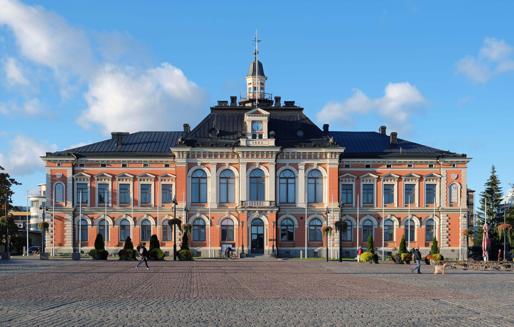
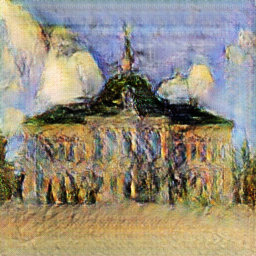
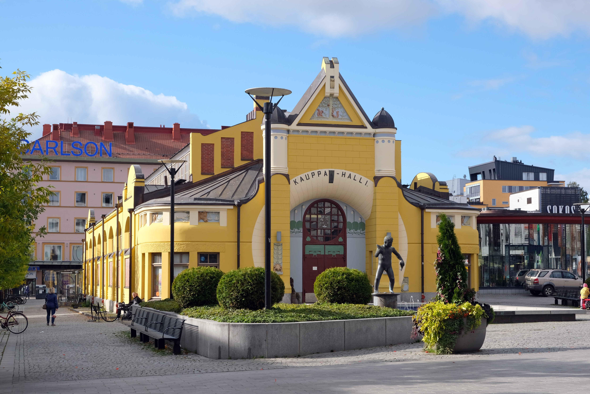
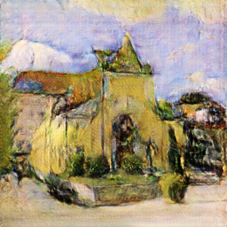
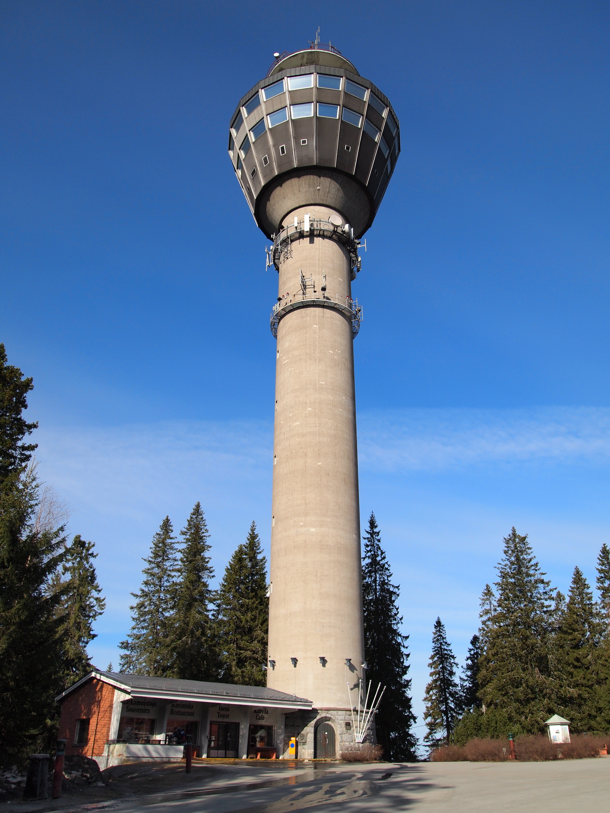
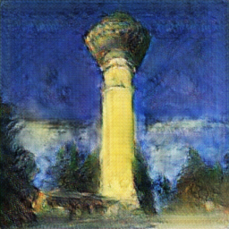

# **CycleGAN: City -> Van Gogh Style City**

This project implements a cycleGAN model that tries to transform city images to Van Gogh style paintings of the city. The project uses PyTorch and the official cycleGAN implementation as a base (GitHub - junyanz/pytorch-CycleGAN-and-pix2pix: Image-to-Image Translation in PyTorch).

# **Prjoject Structure**


```
├─ datasets/         # Datasets (only test data)
├─ checkpoints/      # Only the best checkpoint (.pth)
├─ nets.py           # Generator and Discriminator nets
├─ train.py          # Training loop
├─ test.py           # Tests the trained model with test data
├─ test2.py          # Script for generating training progress images
├─ testData.py       # Test for data.py
├─ testNets.py       # Test for nets.py
├─ testCuda.py       # Test for cuda
├─ requirements.txt 
└─ README.md
```

# **Datasets**
https://www.kaggle.com/datasets/ipythonx/van-gogh-paintings

https://www.kaggle.com/datasets/heonh0/daynight-cityview?select=day

**Test images**

https://commons.wikimedia.org/wiki/File:Kuopio_Town_Hall_2.jpg

https://commons.wikimedia.org/wiki/File:Kuopio_Market_Hall_2020.jpg

https://commons.wikimedia.org/wiki/File:Puijo_tower.jpg

# **Transformation Results**

**Original**




**Transformed**



**Original**



**Transformed**




**Original**




**Transformed**


